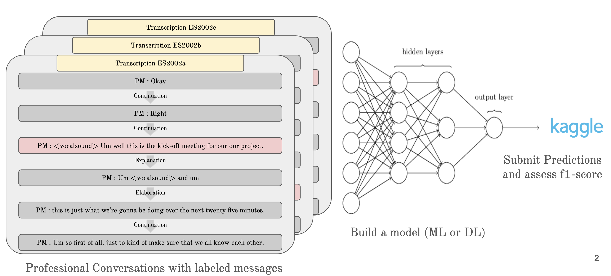
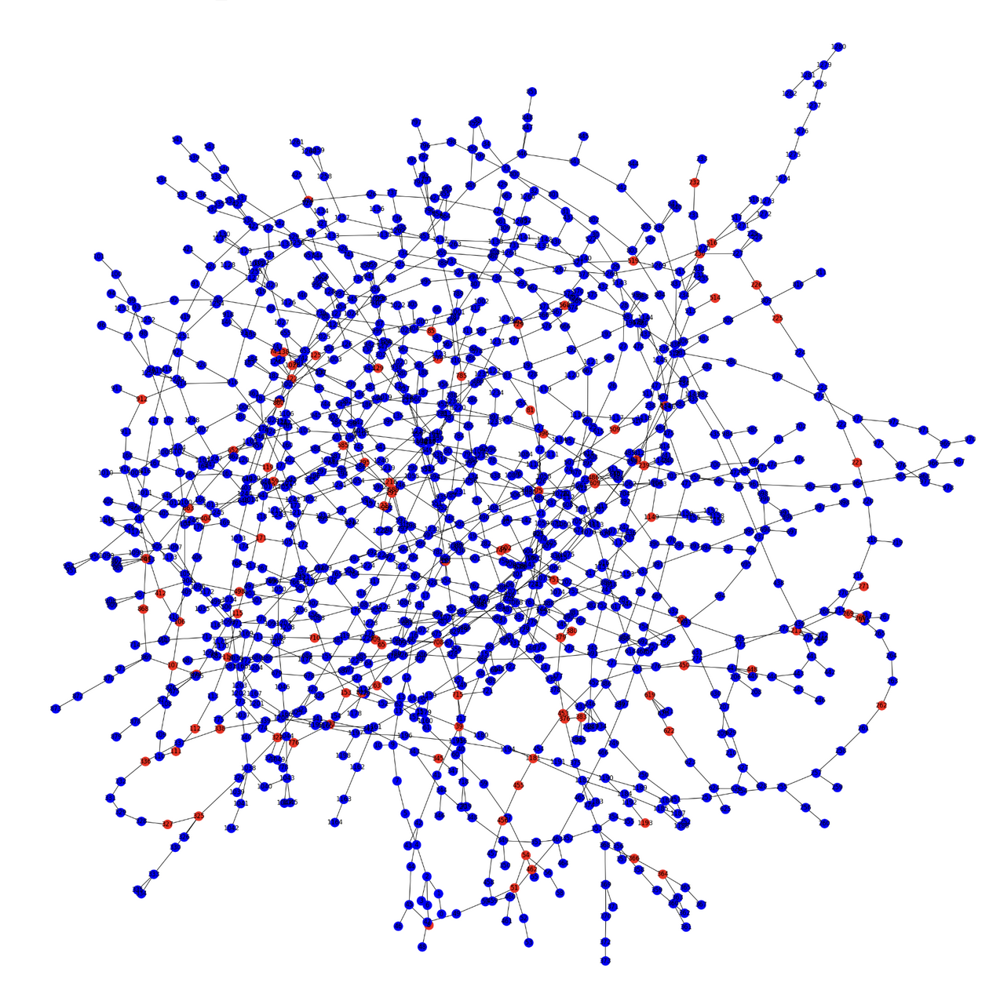

# Extractive Summarization with Discourse Graphs

This repository contains the code and documentation for our Kaggle project titled "Extractive Summarization with Discourse Graphs: A Kaggle Project on Identifying Key Messages in Business Dialogues." Our team, comprising Samuel Gaudin, Mathias Grau, and Alexandre ver Hulst from École Polytechnique, has developed a system for identifying key messages in professional dialogues using advanced machine learning techniques.

## Project Overview

Our project aimed to develop a model capable of accurately predicting the importance of a message in business dialogues. We explored various feature sets and machine learning models, including traditional algorithms like logistic regression and XGBoost, as well as deep learning approaches like neural networks.

 

### Data

The dataset consists of 137 dialogues (97 for training) between four protagonists. Each message in the dialogues is labeled for importance, along with causal links such as continuation, elaboration, and explanation.

  

<b>Graph for conversation ES2002a</b>

### Features

We considered syntactic, lexical, technical, and contextual features:

- Message size
- Type of speaker
- Sentence embeddings using BERT, Word2Vec, and PyTorch Embedding
- TF-IDF scores
- Sentiment analysis
- New specific word feature
- Sentence importance score

## Models and Methodologies

We evaluated various machine learning and deep learning methodologies:

- **Logistic Regression**: Baseline model.
- **Support Vector Machine (SVM)**: For robust classification.
- **Decision Trees and Ensemble Methods (RFC and XGBoost)**: To handle complex decision boundaries.
- **Artificial Neural Networks (ANN)**: Including LSTM for sequential data processing.
- **Graph Neural Networks (GNN)**: To consider the interconnected nature of dialogue.

## Results

Our findings suggest that deep learning methods, especially ANN with LSTM, are more effective in capturing the nuances of professional dialogues. The LSTM Neural Network, which considers sequences of text, emerged as our best model.

## Usage

Start by running the `init.py` file. It will create the pandas dataframes used for future analysis. Then try the `feature_selection.ipynb` file and the `neural_network.ipynb` and `lstm_neural_network.ipynb` files.

## Acknowledgments

Our sincere thanks to Kaggle for hosting this competition and providing the dataset. We also extend our gratitude to École Polytechnique for their support.

---

For any queries or further information, please contact the authors of this project : Samuel Gaudin, Mathias Grau, and Alexander Ver Hulst.
